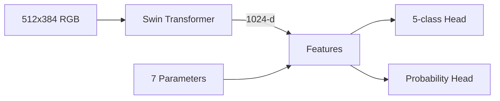

# IVF Embryo Analysis Multimodal Pipeline

A comprehensive framework combining computer vision and clinical data analysis for embryo quality assessment and pregnancy outcome prediction.

This repository contains the code to train a neural network model using features extracted from images with DINO (Distillation with No Labels), specifically Vision Transformer (ViT) models. The purpose of the project is to enhance image classification for biomedical images, particularly in IVF research.

## Table of Contents
- [Overview](#overview)
- [Key Features](#key-features)
- [Requirements](#requirements)
- [Installation](#installation)
- [Usage](#usage)
  - [Feature Extraction with DINO](#feature-extraction-with-dino)
  - [Model Training](#model-training)
  - [Predictions](#predictions)
- [Project Structure](#project-structure)
- [Model Architectures](#model-architectures)
  - [Swin Transformer](#swin-transformer)
  - [KAN Network](#kan-network)
- [Performance](#performance)
- [Input Specifications](#input-specifications)
- [Limitations](#limitations)
- [Ethical Considerations](#ethical-considerations)
- [License](#license)
- [References](#references)

## Overview

This repository contains three integrated models for embryo analysis:

1. **Swin Transformer Model**  
   Multimodal model combining embryo images with clinical data for:
   - 5-class morphology grading
   - Live birth probability prediction

2. **KAN-DINO Model**  
   Hybrid model using DINOv2 image features and clinical data for pregnancy outcome prediction

3. **DINO Feature Extractor**  
   Vision Transformer (ViT) for extracting image embeddings

## Key Features

- **Multimodal Fusion**: Combine image features with clinical parameters
- **Two Prediction Tasks**:
  - Morphology classification (5 classes)
  - Live birth probability estimation
- **Interpretable Architecture**: KAN networks with spline visualizations
- **Automated Preprocessing**:
  - Image normalization
  - Clinical data validation
  - Missing value handling
- **Advanced Architectures**:
  - Swin Transformer for spatial relationships
  - DINOv2 for self-supervised feature extraction
    
The project utilizes Vision Transformer models pre-trained using DINO to extract high-quality features from images, particularly for complex biomedical images such as those used in IVF (in vitro fertilization). These features are then used to train a neural network (KAN) model for classification tasks.
The model uses Swin Transformer for image processing and combines it with clinical data. The main class is EmbryoModel, which is a PyTorch Lightning module. The backbone is SwinTransformer from the timm library, which outputs a 1024-dimensional embedding. Then there are two heads: one for morphology classification (5 classes) and another for live birth prediction, which takes both the image features and clinical data.

- **DINO** extracts global contextual features by dividing images into patches and using a transformer-based approach.
- **KAN (Kolmogorov-Arnold Network)** is a neural network architecture that efficiently handles non-linear relationships between features, offering robust performance on the extracted DINO features.
  
## Requirements

- Python 3.8+
- CUDA 11.7+ (GPU recommended)
- Libraries:
  ```bash
  pip install torch torchvision pytorch_lightning timm pandas numpy scikit-learn tqdm kan-torch Pillow
  ```

## Installation

1. Clone repository:
   ```bash
   git clone https://github.com/embryossa/DINO_KAN.git
   cd ivf-embryo-analysis
   ```

2. Install dependencies:
   ```bash
   pip install -r requirements.txt
   ```

## Usage

### Feature Extraction with DINO

Extract image embeddings using pre-trained ViT:
```bash
python scripts/extract_features.py \
  --model_name vit_large_patch14_dinov2.lvd142m \
  --dataset_path data/images \
  --save_path data/features.csv
```
**Image Processing Pipeline**

```bash
transforms.Compose([
    transforms.Resize(CFG['img_size']),  # 512×384
    transforms.ToTensor(),
    transforms.Normalize(
        mean=[0.485, 0.456, 0.406],
        std=[0.229, 0.224, 0.225]
    )
])
```
Validation ranges enforced during input:

```bash
[
    (1, 6),    # EXP_silver
    (1, 4),     # ICM_silver 
    (1, 4),     # TE_silver
    (0, None),  # COC
    (0, None),  # MII
    (18, 50),   # Age
    (5.0, 20.0) # Endometrial thickness
]
```

### Model Training

**1. Swin Transformer Model**
```bash
python train_swin.py \
  --image_dir data/embryo_images \
  --clinical_data data/clinical.csv \
  --checkpoint_dir models/
```

**2. KAN-DINO Model**
```bash
python train_kan.py \
  --features_path data/features.csv \
  --clinical_data data/clinical.csv \
  --save_path models/kan_model.pth
```

### Predictions

**Live Birth Probability**
```bash
python predict_swin.py \
  --model models/swin_model.ckpt \
  --image data/sample_embryo.png \
  --clinical_data data/patient_data.json
```

**Pregnancy Outcome**
```bash
python predict_kan.py \
  --model models/kan_model.pth \
  --features data/new_features.csv \
  --threshold 0.6
```
### Prediction Workflow

```bash
def forward(self, x, clinical=None):
    # Image features
    features = self.backbone(x)  # 1×1024
    
    # Morphology classification
    morph_logits = self.morphology_head(features)  # 1×5
    
    # Live birth prediction
    if clinical is not None:
        combined = torch.cat([features, clinical], dim=1)  # 1×1031
        birth_pred = self.live_birth_head(combined)  # 1×1
        
    return morph_logits, birth_pred
```


## Project Structure
```
├── data/
│   ├── clinical.csv          # Clinical parameters
│   └── features/             # DINO embeddings
├── models/                   # Pretrained models
├── scripts/
│   ├── extract_features.py   # DINO feature extraction
│   ├── train_swin.py         # Swin Transformer training
│   ├── train_kan.py          # KAN training
│   └── predict*.py           # Prediction scripts
├── utils/
│   ├── data_loader.py        # Dataset handling
│   └── preprocessing.py      # Data normalization
└── configs/                  # Model configurations
```

## Model Architectures

### Swin Transformer

**Multimodal Fusion Network**
```python
Image Input (512×384×3)
    │
Swin Transformer Backbone
    │
1024-dim Image Embedding ────┐
                            ├→ Concatenation → Live Birth Prediction Head
Clinical Data (7 features) ─┘
    │
Morphology Classification Head
```

**Architecture**:


**Key Components**:
- **Backbone**: Swin-T (4-stage hierarchy)
- **Heads**:
  - Morphology: Linear(1024→5)
  - Birth: Linear(1031→256→1)

### KAN Network

**Pipeline**:
```
DINO Features (1024-d) → Concatenate → KAN → Prediction
Clinical Data (7-d)     ↗
```

**Configuration**:
```python
KAN(
  width=[1031, 64, 32, 1],  # 1024 (image) + 7 (clinical)
  grid=5,                    # Spline interpolation points
  k=3,                       # B-spline order
  activation=torch.nn.SiLU
)
```

## Performance

| Model           | ROC AUC | Accuracy | Inference Speed (V100) |
|-----------------|---------|----------|------------------------|
| Swin Transformer| 0.82    | 73%      | 60ms                   |
| KAN-DINO        | 0.85    | 75%      | 45ms                   |

## Input Specifications

**Image Requirements**:
- Format: PNG/JPEG
- Resolution: ≥512×384px
- Color Space: RGB

**Clinical Parameters**:
| Parameter             | Range      | Type   |
|-----------------------|------------|--------|
| EXP_silver (expansion)| 1-6        | int    |
| ICM_silver (quality)  | 1-4        | int    |
| Patient Age           | 18-50      | int    |
| Endometrial Thickness | 5.0-20.0 mm| float  |

## Limitations

1. **Data Constraints**:
   - Requires precise clinical parameter ranges
   - Minimum image resolution 512×384px
   - Western population bias in training data

2. **Technical Limitations**:
   - No temporal sequence handling
   - Fixed input dimensions
   - Computationally intensive (≥8GB VRAM recommended)

## Ethical Considerations

- **Research Use Only**: Not validated for clinical deployment
- **Bias Mitigation**:
  - Regular fairness audits
  - Demographic metadata tracking
- **Interpretability**:
  - KAN spline visualization
  - Feature importance analysis

## License

MIT License. See [LICENSE](LICENSE) for details.

## References

1. Caron et al. (2021) [Emerging Properties in Self-Supervised Vision Transformers](https://arxiv.org/abs/2104.14294)
2. Liu et al. (2024) [KAN: Kolmogorov-Arnold Networks](https://arxiv.org/abs/2404.19756)
3. Blastocyst Dataset: [GitHub Repository](https://github.com/software-competence-center-hagenberg/Blastocyst-Dataset)
4. Wang, et al. (2024) [A generalized AI system for human embryo selection covering the entire IVF cycle via multi-modal contrastive learning] https://doi.org/10.1016/j.patter.2024.100985

---
